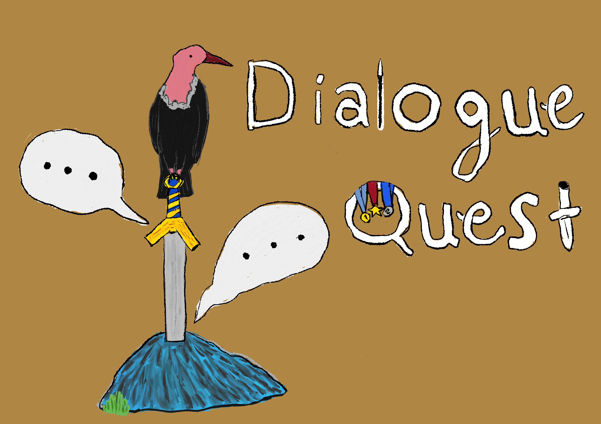

DialogueQuest is a powerful and flexible dialogue management system for Unity, designed to streamline the creation of interactive narratives in your games.

## Features

- Visual node-based dialogue editor
- Support for various node types:
  - Single Node: For linear dialogue sequences
  - Choice Node: For branching conversations with multiple options
  - Quit Node: To end dialogue sequences
- Flag system for tracking story progress and character relationships
- Seamless integration with Unity's Animator component for character animations
- Search functionality to quickly find nodes in complex dialogue trees
- Easy-to-use toolbar for saving, loading, and managing dialogue graphs

## Installation and Setup

1. Clone this repository or download the latest release.
2. Import the DialogueQuest folder into your Unity project's Assets directory.
3. Open the Dialogue Quest Editor window by navigating to Window > Dialogue_Quest in the Unity menu.

## How to Use

1. Create a new dialogue graph by entering a name in the "File Name" field and clicking "Save".
2. Add nodes to your graph by right-clicking in the editor and selecting the desired node type.
3. Connect nodes by clicking and dragging from one node's output port to another node's input port.
4. Edit node properties, such as dialogue text and choices, in the node inspector.
5. Use flags to track variables and create conditional branching in your dialogues.
6. Save your work frequently using the "Save" button in the toolbar.

## Node Types

- **Single Node**: Used for linear dialogue sequences. Can have multiple inputs and outputs.
- **Choice Node**: Represents branching points in the conversation. Allows for multiple choice options.
- **Quit Node**: Marks the end of a dialogue sequence.

## Advanced Features

- **Animations**: Integrate character animations with dialogue using the Animation_Data class.
- **Scene Integration**: Use the Scene_Vision class to easily access GameObjects and Animators in your scene.
- **Search**: Quickly find nodes in large dialogue trees using the search functionality.
# How to Contribute

We’re building Dialogue Quest together with our community, and we’re always glad to have new contributors on board. Here’s how you can get involved and help us along the way:

- Report Bugs and Issues: Spot a bug? Let us know! Reporting issues helps us identify and fix problems quickly, enhancing the user experience of our software.
  
- Share Your Ideas: Have a great idea for a feature or improvement? We’re all ears! Your suggestions can help us to improve Dialogue Quest and make it even better.
  
> [!IMPORTANT]
>  
> For more details, check [this](https://github.com/aydakikio/DialogueQuest/blob/main/CONTRIBUTING.md).

# Donation

We believe in keeping Dialogue Quest completely free and accessible for everyone, and your support makes this possible. Every donation, big or small, helps us continue developing and improving the project. If you enjoy using Dialogue Quest , please consider making a donation.

Donation Ways:

   * Share our project with others
  
   * BitCoin:
     
      > bc1qvg2q52vwpzfrqwjx73uf9q4esexwsxx3u63r9r
      
   * Ethereum:
     
      > 0x92e76FB62555C37eE39beBa5Cf17DB2C0f67856C
      
   * Litecoin:
     
      > ltc1ql4aau4ppcplddv224szvsav8zhqah474k009qk
      
   * Cardano:
     
      > addr1qxy0qskx0d74whguqn85gecf93dtry2j54eryr9agg52y86wj06yzk3pruy02ntwtak7m4naq8wvrj297jmg7eznunus9c7cw2
      

     Thank you for being a part of our community and for your generous support. Together, we can make game development tools accessible to everyone!
   

#  Licence 
 Dialogue Quest is released under the GPL-3.0 License. For more information see [LICENSE](https://github.com/aydakikio/DialogueQuest/blob/main/LICENSE).

